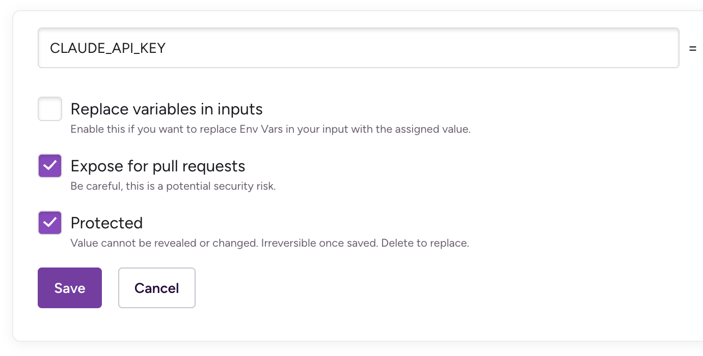
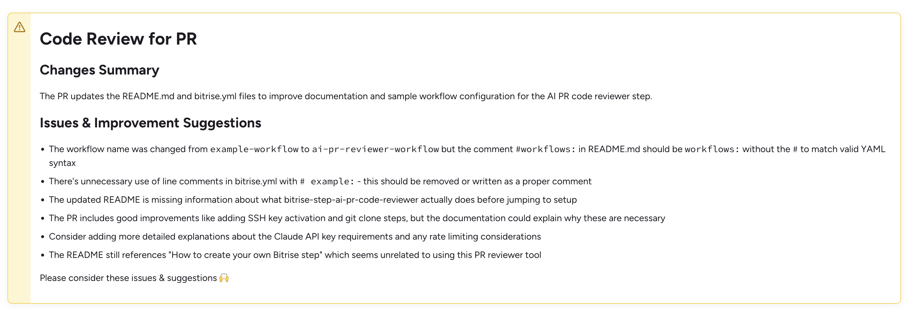
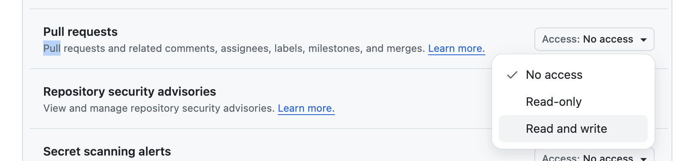

# AI PR Reviewer (using Claude Code)

PR code change review, powered by Claude Code.

## Setup

First, add a new workflow to your bitrise.yml build configuration, with the AI PR Code Reviewer step in the workflow.
You can copy the whole example workflow from here:

```yaml
#workflows:
  ai-pr-reviewer-workflow:
    triggers:
      # run for pull requests; changed_files filter exposes the list of changed files
      pull_request:
      - target_branch: '*'
        source_branch: '*'
        changed_files: '*'
    steps:
    - activate-ssh-key@4:
        run_if: '{{getenv "SSH_RSA_PRIVATE_KEY" | ne ""}}'
    - git-clone@8: {}
    
    - git::https://github.com/bitrise-steplib/bitrise-step-ai-pr-code-reviewer.git@main:
        title: AI PR Code Reviewer
        inputs:
        # The only required input is the API key
        # API key for Anthropic's Claude API.
        # Can be obtained from https://console.anthropic.com/settings/keys
        - claude_api_key: "$CLAUDE_API_KEY" # <- Define this as a Secret, enable "Expose for Pull Requests" if you want to use it in PRs.
        # Optional inputs
        # Review prompt. We defined a default one, but you can override it here.
        - review_prompt: |-
            You are code reviewer reviewing these changes.
            Print out the changed files, and then provide a bullet point list of issues and improvement ideas. Use markdown format.
        # Context files
        - context_files: "$BITRISE_SOURCE_DIR/CODE_REVIEW_GUIDE.md" # You can define one or more files to include as context for the AI review.
    
    - deploy-to-bitrise-io@2: {}
```

Add `CLAUDE_API_KEY` as a secret, with your Anthropic/Claude API key.
Don't forget to enable "Expose for Pull Request" for the API Key:


Also make sure you have `changed_files: '*'` condition to the `pull_request` trigger, like you can see in the example workflow above (in case you haven't copy pasted the example, or if you modified the `triggers` section).

If you want to, customize the `review_prompt` and the `context_files` inputs, or you can also
remove them if you want to use theh default prompt and no context files.

That's it, you're now ready to use the AI PR Reviewer! 🚀

Once you run a build with this workflow, you'll see the review as an annotation on the Bitrise build's page:



### Show the PR Review on the GitHub Pull Request

The AI PR Code Reviewer step exposes the review it generates in the output environment variable `$BITRISE_AI_REVIEW`.
You can combine this with other steps, for example with the `comment-on-github-pull-request` step.

```yaml
# workflows:
#   ai-pr-reviewer-workflow:
#     triggers:
#       ...
#     steps:
#     - activate-ssh-key@4:
#         run_if: '{{getenv "SSH_RSA_PRIVATE_KEY" | ne ""}}'
#     - git-clone@8: {}
#   
#   - git::https://github.com/bitrise-steplib/bitrise-step-ai-pr-code-reviewer.git@main:
#       title: AI PR Code Reviewer
#       ...
    
    - comment-on-github-pull-request@0:
        inputs:
        - personal_access_token: $GITHUB_PERSONAL_ACCESS_TOKEN
        - body: $BITRISE_AI_REVIEW
        - update_comment_tag: bitrise-ai

#     - deploy-to-bitrise-io@2: {}
```

Once you added the `comment-on-github-pull-request` step, you also have to set `GITHUB_PERSONAL_ACCESS_TOKEN` as a Secret (which is exposed to pull requests).

You can generate a Personal Access Token at: [https://github.com/settings/personal-access-tokens](https://github.com/settings/personal-access-tokens).
You can use `Fine-grained tokens`, just make sure you set the `Read and Write access to pull requests` scope for the token, under the `Permissions > Repository permissions` section:




## How to create your own Bitrise step

1. Create a new git repository for your step (**don't fork** the *step template*, create a *new* repository)
2. Copy the [step template](https://github.com/bitrise-steplib/step-template) files into your repository
3. Fill the `step.sh` with your functionality
4. Wire out your inputs to `step.yml` (`inputs` section)
5. Fill out the other parts of the `step.yml` too
6. Provide test values for the inputs in the `bitrise.yml`
7. Run your step with `bitrise run test` - if it works, you're ready

__For Step development guidelines & best practices__ check this documentation: [https://github.com/bitrise-io/bitrise/blob/master/_docs/step-development-guideline.md](https://github.com/bitrise-io/bitrise/blob/master/_docs/step-development-guideline.md).

**NOTE:**

If you want to use your step in your project's `bitrise.yml`:

1. git push the step into it's repository
2. reference it in your `bitrise.yml` with the `git::PUBLIC-GIT-CLONE-URL@BRANCH` step reference style:

```
- git::https://github.com/bitrise-steplib/bitrise-step-ai-pr-code-reviewer.git@branch:
   title: AI PR Reviewer (using Claude Code)
   inputs:
   - claude_api_key: "$CLAUDE_API_KEY"
   - review_prompt: "Your custom review prompt here"
```

You can find more examples of step reference styles
in the [bitrise CLI repository](https://github.com/bitrise-io/bitrise/blob/master/_examples/tutorials/steps-and-workflows/bitrise.yml#L65).


## How to contribute to this Step

1. Fork this repository
2. `git clone` it
3. Create a branch you'll work on
4. To use/test the step just follow the **How to use this Step** section
5. Do the changes you want to
6. Run/test the step before sending your contribution
  * You can also test the step in your `bitrise` project, either on your Mac or on [bitrise.io](https://www.bitrise.io)
  * You just have to replace the step ID in your project's `bitrise.yml` with either a relative path, or with a git URL format
  * (relative) path format: instead of `- original-step-id:` use `- path::./relative/path/of/script/on/your/Mac:`
  * direct git URL format: instead of `- original-step-id:` use `- git::https://github.com/user/step.git@branch:`
  * You can find more example of alternative step referencing at: https://github.com/bitrise-io/bitrise/blob/master/_examples/tutorials/steps-and-workflows/bitrise.yml
7. Once you're done just commit your changes & create a Pull Request


## Share your own Step

You can share your Step or step version with the [bitrise CLI](https://github.com/bitrise-io/bitrise). If you use the `bitrise.yml` included in this repository, all you have to do is:

1. In your Terminal / Command Line `cd` into this directory (where the `bitrise.yml` of the step is located)
1. Run: `bitrise run test` to test the step
1. Run: `bitrise run audit-this-step` to audit the `step.yml`
1. Check the `share-this-step` workflow in the `bitrise.yml`, and fill out the
   `envs` if you haven't done so already (don't forget to bump the version number if this is an update
   of your step!)
1. Then run: `bitrise run share-this-step` to share the step (version) you specified in the `envs`
1. Send the Pull Request, as described in the logs of `bitrise run share-this-step`

That's all ;)
